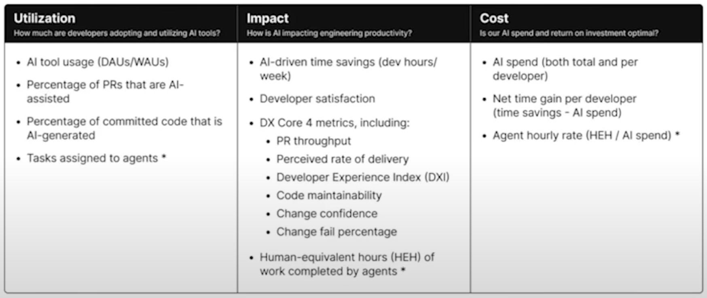

AI is a neat tool. As with all neat tools there are times to use it and times to
avoid it, or to pick a better tool. Here's a brief summary of my experience so
far. If I were to sum it up: use AI when the stakes are low, the results don't
matter, and you just need something "good enough" done.

Do _not_ use AI:

- Learning about a codebase: it will make things confusing and the learning
    won't stick as well as manually walking around through the codebase via LSP
- Getting work done in an unfamiliar context: you won't _really_ know if it
    is sneaking a business bug in there, even if the code is correctly placed
    and logically sound (which it often also is not)
- Writing communications to people you know: it will be obvious and could be
    offensive.
- Story telling: I've tried this a few times with my 5yo and while the stories
    technically are stories, they suck. Use your brain and be in the moment,
    a parents made up on the spot stories will always be more fun for all

_Do_ use AI:

- Bypassing search ads, site ads, or other obnoxious things about the web:
    the best example I've found is looking for a recipe. 
- Coding when you know EXACTLY what you want and you are confident in your
    ability to describe it. I'll caveat this with you _should_ have your agent
    fully trained with a good amount of context setup about coding style before
    doing this
- Coding when the task is well worn: AI was trained on existing code, it's good
    at something that exists in 10K codebases already, let it do it _if_ it's
    just busy work for you and not part of learning
- When talking to an AI: for example when replying to a recruiter email - this
    is probably an AI you're talking to, don't waste your time
- Taking notes and summarizing things: I use superwhisper for this and love
    it, speaking to an AI with your voice and having it respond feels very
    good/natural vs typing things out. Superwhisper also works with claude code
    or gemini cli.
- Blog logos: see above :)

## AI Cost 

[youtube reference](https://youtu.be/xHHlhoRC8W4?si=sSBwr6WXjpE-ZcTm)

The cost of AI includes developer happiness and productivity as well as the
actual cost of the AI

When do people use AI?

