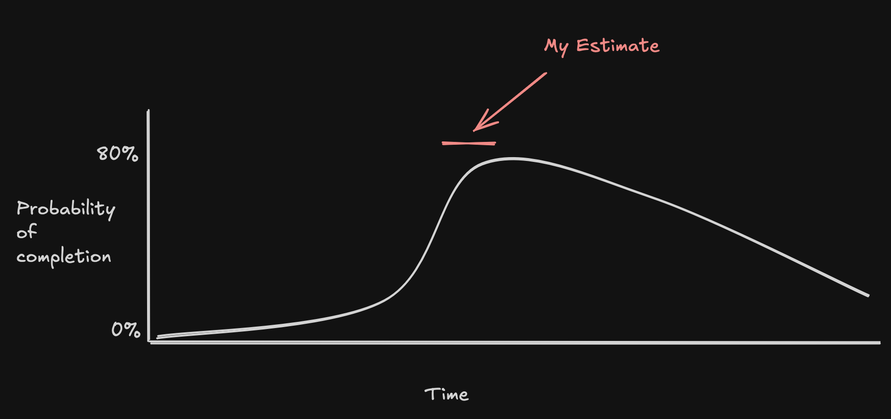

When estimating the mind can go into three areas of importance we should examine
in order, stopping at the first that will give a satisfactory result:

1. Why do you want to know how long it will take? What is the action or decision
   this information will drive? Can I answer that question directly _instead_ of
   providing an estimate?
2. Are you genuinely curious about the probability distribution of how long
   different types of software can take based on risk and experience? I can
   provide that distribution curve (see below)
3. Are you looking for a commitment date? If so, I'm guessing you already have
   one in mind, why don't you just share it with me and we can work within that
   constraint. Picking this option gives up the ability to say _what_ will be
   delivered.

## 1. What's the _real_ question?

Almost always someone is asking how long something will take because someone
else asked _them_ and they only want it because they're a completionist when
making some gantt chart. If there's no good reason to have an estimate then
_never_ give one.

## 2. What's the probability distribution

Sometimes you find someone genuinely interested in how one might guess at how
long software will take. In this case it's important to understand that time
flows in one direction which creates an asymmetric probability distrubution for
when things may get done:

For example, you're never 50% early when taking a flight. You may rarely be a
little early, but there's far more time on the other side of the scheduled
arrival and so far more flights are late than early or on time.

## 3. Commitment Date

This is the most common scenario and it's also sadly mistaken. When business
sets a commitment date they give up the "what" will be delivered. This can often
be fine, engineers are great at working within constarints. However, when
business asks, "when will X be delivered", it's a TRAP! What they're trying to
do is the impossible: to know both when and what will be delivered. In this case
we need to be clear - we can agree on a date, or we can talk in depth about what
we'll deliver and about probability distributions, we cannot have both a
commitment date and an agreement on deliverables.

